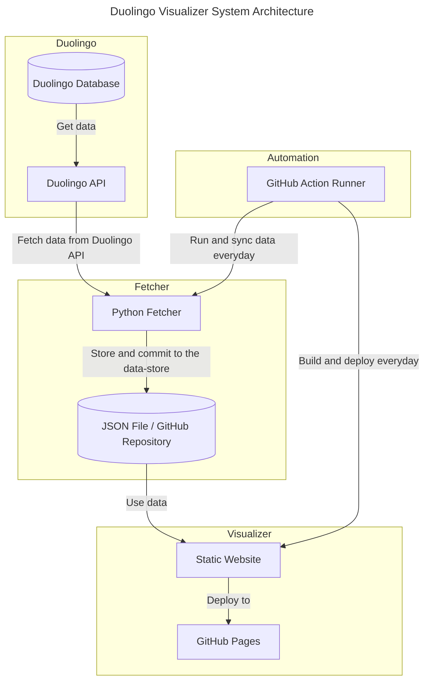

# Japanese Duolingo Visualizer

Visualize your 日本語 progress in Duolingo everyday. Powered with Python, Poetry, GitHub Actions, and GitHub Pages (HTML, CSS, JS, Bootstrap).

Currently, the automation is done and fully tested, and the website is live on GitHub Pages. Please see the link in the repository to take a look!

## Motivation

Everyday, I practice 日本語 on Duolingo.

One feature that I find the lack of it disturbing in Duolingo is a feature to visualize a graph/plot to trace your language learning progression. As with other skills, language requires you to constantly train and practice everyday to ensure that your skills are always at the bleeding edge. Essentially, by having that feature, we could trace our language learning progression everyday, which I believe is good for several reasons. Gaining a constant amount of Duolingo's experience points everyday would allow you to give an idea about how continuous your learning progression is. We trace several points to be visualized during the usage of the application. All of these metrics will be plotted to a chart to help you visualize your progress.

Mainly, this project is inspired by:

- [Satella](https://github.com/lauslim12/Satella)
- [Freedomofkeima's GitHub Profile Visualizer](https://github.com/freedomofkeima/github-profile-visualizer)
- [Kartik Talwar's Unofficial Duolingo API](https://github.com/KartikTalwar/Duolingo)

Thank you for the inspiration!

## Visualizations

Metrics that are visualized in this website:

- Experience points gain
- Time spent in Duolingo
- Number of sessions (lessons, events, or tests) taken
- Streak information

Please note that all of these metrics will be updated and synchronized daily and strives to show an accurate representation of your progress.

Experience points gain, time spent in Duolingo, and number of sessions will be synchronized with the API (your real data) with each run, so you would have no worries about the accuracy of your progress.

## System Architecture

This system is composed of three components: `Fetcher`, `Visualizer`, and `Automation`. The following graph shows the representation of the system architecture and its components as a whole.



## Usage (Automatic)

This right and recommended usage of this is 'you should never have to run this script manually, except in some rare circumstances'. The way to use this repository is as follows:

- Fork this repository!
- Log in to your Duolingo account in your web browser.
- Get your JWT (I assume you're using Google Chrome) from `Inspect` -> `Application` -> `Cookies` -> Copy the `jwt_token` entry.
- Put several secrets in the repository (`Settings` -> `Secrets` -> `Actions`): `DUOLINGO_USERNAME`, `DUOLINGO_PASSWORD`, `DUOLINGO_JWT`.
- You have to use your real credentials, or else the API will not let you in. Feel free to check the source code if you supect anything!
- Put more secrets: `GIT_AUTHOR_EMAIL`, and `GIT_AUTHOR_NAME` (equivalent when you're setting up Git: `git config --global user.email ...`).
- For the first time, you should clear the `data/duolingo-progress.json` file manually, leaving only `[]` (an empty array) in that file.
- Wait for the cron, and then the script will run properly without you having to do anything! Please check the repository to see the update. You probably have to do a dry-run manually to initially populate the data so it can show the initial graph.

Please note that sometimes the cron scheduler may delay because of some unforeseen circumstances at GitHub's side. That's why I provided the `workflow_dispatch` option, so it could be run, even when the cron scheduler fails to run.

It is recommended that you run this script **with your JWT and not your password for safety concerns.**

## Usage (Manual)

This should be dedicated for GitHub Actions only. If you want the script manually, then:

```bash
# Clone repository.
git clone git@github.com:lauslim12/japanese-duolingo-visualizer.git
cd japanese-duolingo-visualizer

# Use `poetry`.
poetry shell
poetry install

# Put necessary environment variables, or else it will not work.
export DUOLINGO_USERNAME=...
export DUOLINGO_PASSWORD=...
export DUOLINGO_JWT=...

# Run script.
poetry run python3 main.py
```

For development, if you wish to develop the visualizer, you have to mock the data in the `web/index.html`, more specifically, the `getDataFromJSON()` function. You have to hard-code (change the `response.json()`) and change it to something like the following:

```json
[
  {
    "date": "2022/07/28",
    "number_of_sessions": 27,
    "session_time": 4792,
    "streak": 1,
    "xp_today": 754
  }
]
```

You may have to add more than one data to make sure that it is rendering well enough. Developing the other components should be more straightforward (Python code and GitHub Actions as the infrastructure).

## Notes

Ensure to run these scripts to keep the code quality consistent:

```bash
# run black, isort, mypy, and pytest
poetry run black src
poetry run isort src
poetry run mypy
poetry run pytest --verbose --cov=src tests
```

Please also write tests if you want to add a new feature!

## Credits

Aside from the names and projects written above, I would also like to thank:

- [Icons8.com](https://icons8.com/icon/59388/hiragana-hi) for providing the favorite icon.

## License

MIT License.
